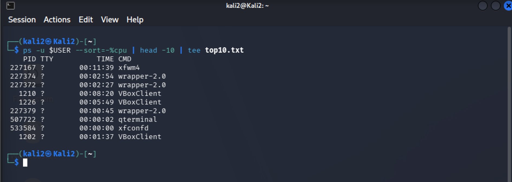
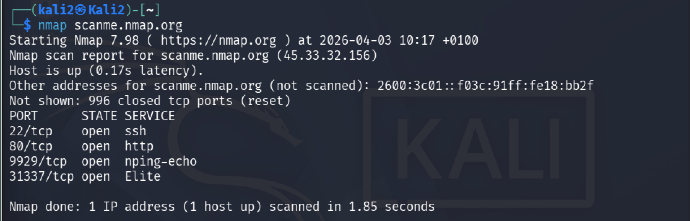
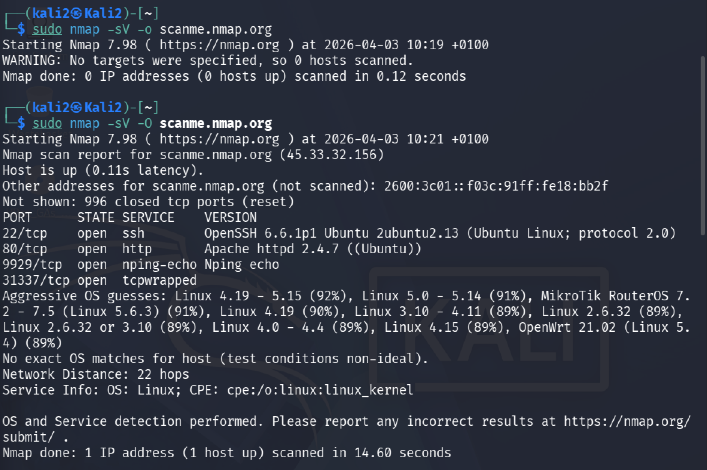
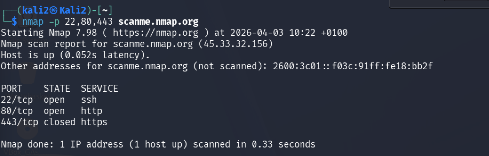
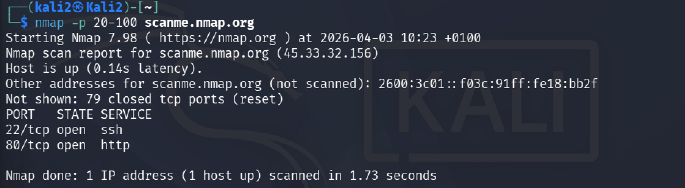
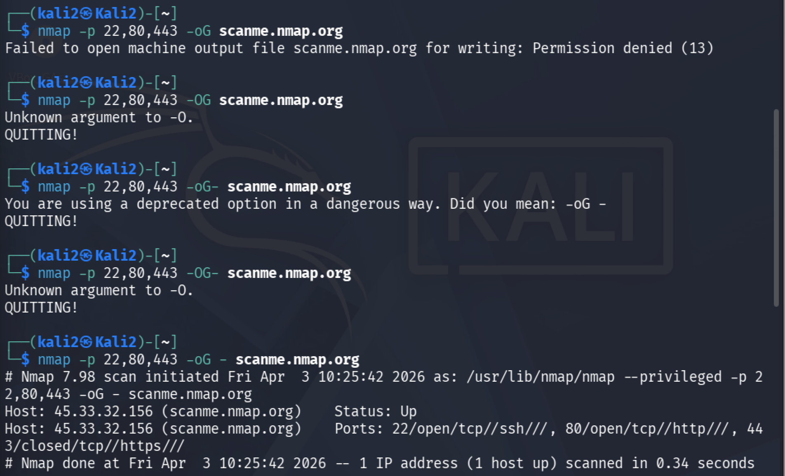

# Домашняя работа 3

## Task 1 — Список процессов

ps -u $USER --sort=-%cpu | head -10 | tee top10.txt

Вывод топ-10 процессов текущего пользователя с сортировкой по CPU и сохранением результата в файл.

---

## Task 2 — Сканирование с помощью nmap

nmap scanme.nmap.org

Базовый скан хоста scanme.nmap.org с отображением открытых портов.

---

## Task 3 -  Определение сервисов и операционной системы

sudo nmap -sV -O scanme.nmap.org

Параметр -sV показывает версии сервисов, а -O пытается определить операционную систему.

Определение сервисов и предполагаемой операционной системы.

---

## Task 4 -  Сканирование конкретных портов

nmap -p 22,80,443 scanme.nmap.org

Проверяются только указанные порты: 22, 80 и 443.

Сканирование выбранных портов.

---

## Task 5 -  Сканирование диапазона портов

nmap -p 20-100 scanme.nmap.org

Проверяются все порты в диапазоне от 20 до 100.

Сканирование диапазона портов.

---

## Task 6. Вывод в grepable формате

nmap -p 22,80,443 -oG - scanme.nmap.org

Результат выводится в специальном формате (grepable) прямо в терминал.

Вывод результата в grepable формате в терминал.

---

##Task 7. Ошибка и её исправление

Команда с ошибкой:

sudo nmap -sV -o scanme.nmap.org

Ошибка произошла из-за использования неправильного флага (-o вместо -O). После исправления команда выполняется корректно.

В верхней части показана ошибка, в нижней — исправленная команда и успешный результат.

---

